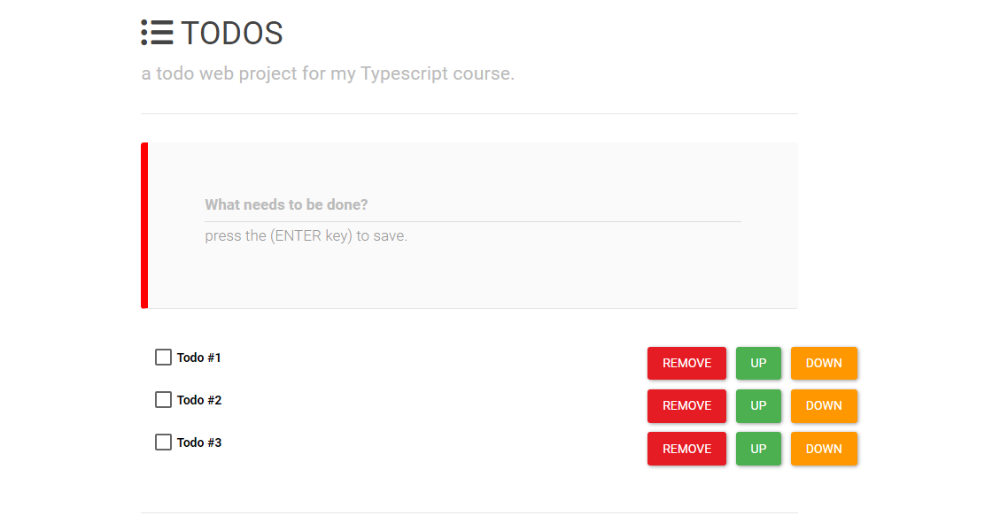

## Todo-list Aplication With TypeScript & JavaScript.

Todo-list application which allows to add, delete, mark as finished & sort.

**Contains the following fucntions:**
* Show a list of todos.
* Add a new todo-item.
* Delete a todo-item.
* Sort (Move a todo-item up or down in the list).
* Mark a todo-item as finished.

